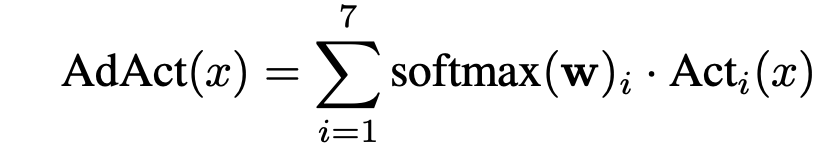

# ADACT: LEARNING TO OPTIMIZE ACTIVATION FUNCTION CHOICE THROUGH ADAPTIVE ACTIVATION MODULES

This repository is an implementation of the Adact activation function as described in the paper of the same title.

## Key Takeaways
- The activation was proposed and experimentally proven to improve the performance of ResNet on CIFAR datasets by around 1%-2%.
- This code aims to explore the relevance of these findings to transformer architectures, especially with **BERT** on the **GLUE SST-2 task**.

## Activation Function

The ADACT activation follows the mathematical formulation:



Where:
- **Activations list**: ReLU, ELU, RReLU, PReLU, SiLU, LReLU, Mish
- The softmax-weighted sum allows the network to dynamically adjust and combine multiple activation functions during training.

## Usage

1. **Clone the repository**:
   ```bash
   git clone https://github.com/cvnad1/adact.git
   cd adact
   ```

2. install requirements
   ```bash
   pip install -r requirements.txt
   ```

3. Run
  ```bash
  python main.py
```

The custom implementation of ADACT can be found in adact.py. Feel free to customize it by adding new activations or modifying main.py to test on other models or datasets.


## Results

| Dataset        | Model         | Baseline Accuracy | ADACT Accuracy |
|----------------|---------------|-------------------|----------------|
| GLUE (NLP)     | BERT-base     | 90.0% (avg.)      | 81.2% (avg.)   |


## Citation
```
@inproceedings{adact2025,
  title={Learning to Optimize Activation Function Choice through Adaptive Activation Modules},
  author={Ritabrata Maiti},
  booktitle={International Conference on Learning Representations (ICLR)},
  year={2024},
  url={[https://openreview.net/pdf?id=ADACT2025](https://openreview.net/pdf?id=M7d5k4AxCE)}
}
```

## Licence

This project is licensed under the MIT License. See the LICENSE file for more details.


